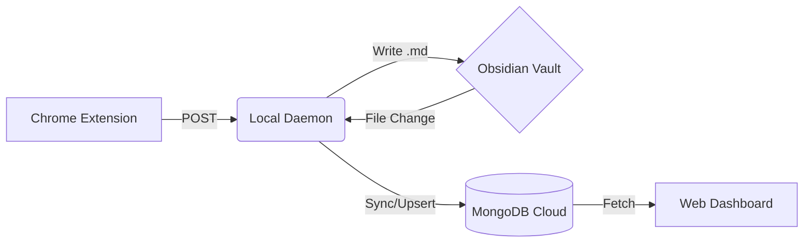

# 🔮 Grimoire

> _A personal archive of algorithmic spells and data structure incantations._

**Grimoire** is a "Local-First" knowledge engine that seamlessly syncs your LeetCode solutions into your Obsidian vault, and then mirrors them to a cloud database for sharing with friends.

It treats your local file system as the Master, and the cloud as a Read-Only Replica.

---

## 🏛️ Architecture

The system consists of three distinct entities:

1.  **👁️ The Eye (Chrome Extension):**
    - Watches your LeetCode browser tab.
    - Scrapes problem data, solution code, and submission stats.
    - Sends payload to the local Daemon.

2.  **👻 The Spirit (Local Daemon):**
    - A background Node.js service running on your machine.
    - **Receiver:** Accepts data from The Eye and writes a beautifully formatted Markdown file to your Obsidian vault.
    - **Watcher:** Monitors your Obsidian folder for _any_ changes (edits, new tags, refactors).
    - **Syncer:** Pushes updates to the Cloud Database in real-time.

3.  **🪞 The Mirror (Cloud & Web Client):**
    - **MongoDB:** Stores the JSON representation of your notes.
    - **Web Dashboard:** A read-only interface for friends to browse your Grimoire, filter by tags, and view your progress.

