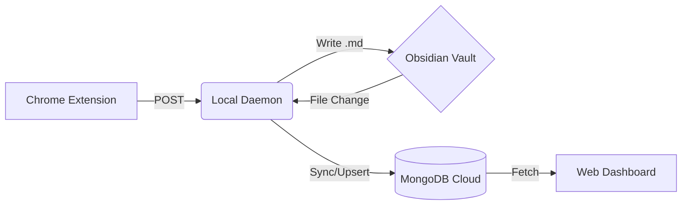

# 🔮 Grimoire

> _A personal archive of algorithmic spells and data structure incantations._

**Grimoire** is a "Local-First" knowledge engine that seamlessly syncs your LeetCode solutions into your Obsidian vault, and then mirrors them to a cloud database for sharing with friends.

It treats your local file system as the Master, and the cloud as a Read-Only Replica.

---

## 🏛️ Architecture

The system consists of three distinct entities:

1.  **👁️ The Eye (Chrome Extension):**
    - Watches your LeetCode browser tab.
    - Scrapes problem data, solution code, and submission stats.
    - Sends payload to the local Daemon.

2.  **👻 The Spirit (Local Daemon):**
    - A background Node.js service running on your machine.
    - **Receiver:** Accepts data from The Eye and writes a beautifully formatted Markdown file to your Obsidian vault.
    - **Watcher:** Monitors your Obsidian folder for _any_ changes (edits, new tags, refactors).
    - **Syncer:** Pushes updates to the Cloud Database in real-time.

3.  **🪞 The Mirror (Cloud & Web Client):**
    - **MongoDB:** Stores the JSON representation of your notes.
    - **Web Dashboard:** A read-only interface for friends to browse your Grimoire, filter by tags, and view your progress.

✨ Features
Zero-Friction Capture: Solve a problem, click one button, and it's in your Obsidian vault forever.

Two-Way Sync: Edit your notes in Obsidian (add explanations, fix typos, add tags) and the changes automatically reflect on the web dashboard.

Smart Linking: Automatically generates [[WikiLinks]] to related problems. If the note exists, it links to it. If not, it links to the LeetCode problem page.

Tag Notes: Supports "Meta-Notes" (e.g., Dynamic Programming.md). The system distinguishes between Problems and Topics automatically.

Spaced Repetition Ready: auto-generates Frontmatter with date_solved, next_review, and review_count for use with the Obsidian Dataview plugin.

🚀 Setup & Installation

1. The Spirit (Daemon)
   The heart of the operation. It must be running for sync to work.

Bash

# Clone the repo

git clone [https://github.com/yourusername/grimoire.git](https://github.com/yourusername/grimoire.git)
cd grimoire/daemon

# Install dependencies

npm install

# Configure Environment

# Create a .env file with:

# OBSIDIAN_VAULT="C:/Users/You/Documents/Obsidian/Grimoire"

# CLOUD_API_URL="[https://your-grimoire-api.vercel.app/api/problems](https://your-grimoire-api.vercel.app/api/problems)"

# Summon the Spirit

npm start 2. The Eye (Extension)
Go to chrome://extensions/

Enable "Developer Mode".

Click "Load Unpacked" and select the extension/ folder.

3. The Mirror (Web Dashboard)
   Deploy the server/ folder to Render or Vercel (as a Node API).

Set up a MongoDB Atlas cluster.

Deploy the client/ folder to Vercel.

📂 Vault Structure
Your Obsidian vault will look like this:

Plaintext
📂 Grimoire/
├── 📂 Algorithms/
│ ├── Array.md # Tag Note
│ ├── Dynamic_Programming.md
├── 📂 LeetCode/
│ ├── 1. Two Sum.md # Problem Note
│ ├── 217. Contains Duplicate.md
🔮 Future Roadmap
[ ] Spaced Repetition Dashboard: A view in the web client showing what problems are due for review today.

[ ] Graph View: A WebGL graph visualization of problem connections (D3.js).

[ ] Streak Tracker: github-style heat map of daily solves.

"Any sufficiently advanced technology is indistinguishable from magic."
